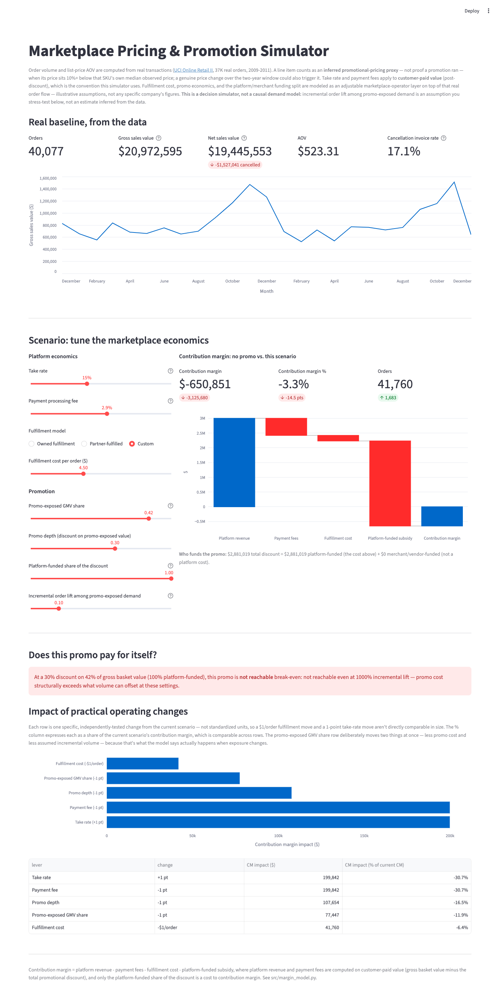

# Marketplace Pricing & Promotion Simulator

An interactive contribution-margin model for a marketplace/e-commerce
operator, built to answer the question every operator eventually gets
asked: **"if margins are low, what would you do?"**



**This is a decision simulator, not a causal demand model.** It does
not estimate elasticity or incrementality from the data, does not
predict actual marketplace outcomes, and does not have access to any
real marketplace company's data. Order volume and list-price AOV are
real, observed numbers from a public dataset; everything a marketplace
operator would actually control -- take rate, fulfillment cost, promo
economics, funding split -- is an explicit, adjustable assumption the
user supplies and stress-tests.

## What it answers

- What's the real contribution margin today, decomposed into platform
  revenue, payment fees, fulfillment cost, and the promo subsidy the
  platform actually pays for?
- If a promo covers X% of gross basket value at Y% depth, how much
  incremental order volume does it need among promo-exposed demand to
  break even on contribution margin -- computed directly, not eyeballed
  off a slider?
- Of a specific set of practical operating changes -- take rate,
  fulfillment cost, payment fee, promo depth, promo exposure -- which
  produces the largest contribution-margin impact right now?
- How does the picture change if a promo is fully platform-funded vs.
  shared with a merchant/vendor, or if fulfillment is owned vs.
  partner-fulfilled?

## Data: what's observed, what's inferred, what's assumed

[UCI Online Retail II](https://archive.ics.uci.edu/dataset/502/online+retail+ii)
(CC BY 4.0, no login required): ~1.06M real order line items / ~40K
orders from a UK-based online retailer, Dec 2009-Dec 2011, including
cancellations. `scripts/download_data.py` pulls it directly from
UCI's servers; `src/data_prep.py` cleans it.

- **Observed directly:** order volume, line-item quantities and prices,
  invoice dates, cancellations.
- **Inferred, not observed:** promotional pricing. No promo field
  exists in the source data. A line item is flagged as an **inferred
  promotional-pricing proxy** when its price sits 10%+ below that
  SKU's own median observed price across the full two-year dataset.
  That's a proxy, not proof a promotion ran -- a bulk-order discount,
  a data-entry variance, or a genuine list-price change over the
  window could all trigger it. Because the reference price is a
  full-period median rather than a time-windowed one, a legitimate
  price change partway through the window can also look like a
  promotion. This project intentionally does not build a rolling-
  price or causal pricing model to fix that -- it's a Strategy & Ops
  scenario tool, not an academic pricing paper -- but the limitation
  is real and worth knowing before trusting the proxy at face value.
- **Modeled assumptions, adjustable in the app:** take rate, payment
  processing fee, fulfillment cost per order, and the
  platform/merchant funding split on any promo. None of these exist
  in single-retailer data; they represent a marketplace operator
  sitting on top of this real order flow.

**Customer_ID:** ~23% of rows (~14% of revenue) have no Customer_ID --
real guest/unregistered checkouts in this dataset, not data errors.
Nothing in the margin model depends on customer identity, so these
rows are kept; only the informational "unique customers" count
(not currently surfaced in the app) would undercount as a result.

## Contribution-margin accounting

Every dollar in a promo-exposed transaction is accounted for as:

```
gross basket value (list price, pre-discount)
- promotional discount
= customer-paid value
```

The promotional discount is split between whoever funds it:

```
promotional discount = platform-funded subsidy + merchant/vendor-funded subsidy
```

**Take rate and payment-processing fees apply to customer-paid value**
(post-discount) -- the actual dollar amount that changes hands and
flows through the platform's payment rails, which is how most
marketplaces compute take rate in practice. A minority convention
applies take rate to the pre-discount list price instead; this
simulator does not use that convention. Only the platform-funded share
of the discount reduces contribution margin -- the merchant-funded
share is shown for transparency but isn't the platform's money.

```
Contribution margin = platform revenue - payment fees - fulfillment cost - platform-funded subsidy
```

Promo exposure is measured as a **GMV share, not an order-count
share**: the dollar value of promo-flagged line items divided by total
list value, weighted so a large discounted item moves the number more
than a single small one. An order with one discounted SKU and four
full-price SKUs barely registers, rather than counting as fully
"promo-exposed." Promo depth is similarly GMV-weighted, not a simple
average across line items. See `baseline_metrics()` in
`src/margin_model.py`.

Demand response is modeled as **incremental order lift among
promo-exposed demand specifically** (not marketplace-wide), applied
only to the share of gross basket value that's promo-exposed. This is
a user-supplied assumption to stress-test, not an estimate inferred
from the data.

## Breakeven and sensitivity

`find_breakeven_lift()` solves for the minimum incremental order lift
a promo needs to match the no-promo contribution margin, by reusing
`run_scenario()` in a binary search rather than re-deriving the
economics -- so it can never drift out of sync with what the sliders
compute. The solver can search up to 1000% incremental lift
mathematically; the UI separately flags results above ~25-100% as
increasingly commercially aggressive, since a mathematically reachable
answer isn't automatically a realistic one.

`sensitivity_ranking()` tests five specific, practical operating
changes from the current scenario (not standardized units -- a
$1/order fulfillment move and a 1-point take-rate move aren't
equal-sized economically) and ranks them by contribution-margin
impact. Each row also reports the change as a % of the current
scenario's contribution margin, which *is* comparable across levers.
The promo-exposure row deliberately moves two things at once -- less
promo cost and less assumed incremental volume -- because that's what
the demand equation says actually happens when exposure changes.

## Fulfillment presets

"Owned fulfillment" and "Partner-fulfilled" are illustrative dollar
assumptions to make scenarios concrete, not any real company's
fulfillment economics -- Gopuff's, Uber's, DoorDash's, or otherwise.

## Run it

```bash
python3 -m venv venv && source venv/bin/activate
pip install -r requirements.txt
python scripts/download_data.py
python src/data_prep.py
streamlit run app.py
```

## Tests

```bash
pytest tests/
```

19 tests covering: zero/full promo exposure and platform funding,
customer-paid-value and funding-split reconciliation, individual lever
effects on contribution margin holding everything else constant, the
zero-orders edge case, the breakeven solver (reaches the no-promo CM
target, and correctly reports "unreachable" when a promo is
structurally dilutive), promo exposure's dual effect on cost and
volume, sensitivity ranking against direct `run_scenario()` output, and
GMV-weighted promo exposure/depth against a small hand-computed
fixture.

## Limitations

- Promotional pricing is inferred, not observed -- treat it as a proxy.
- The SKU reference price is a full-period median, so it can misread a
  genuine price change as a promotion (see Data section above).
- Fulfillment cost presets are illustrative, not sourced from any real
  company.
- This is not a causal demand model -- no elasticity or incrementality
  is estimated from the data; demand response is a user assumption.
- The dataset is a single UK retailer, not an actual marketplace, so
  take rate, payment fees, and promo funding are entirely modeled, not
  observed.

## Structure

```
scripts/download_data.py   pulls the raw dataset from UCI (no login)
src/data_prep.py           cleans transactions, derives the promo proxy
src/margin_model.py        contribution-margin accounting, breakeven solver, sensitivity ranking
app.py                     Streamlit dashboard
tests/test_margin_model.py unit tests
```
